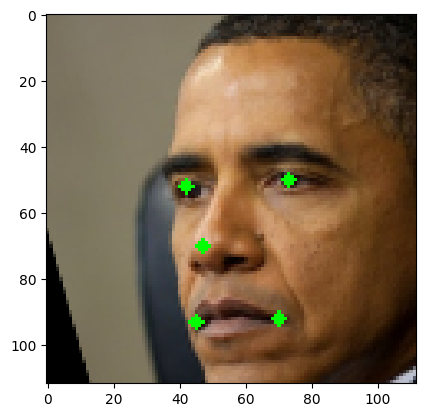

# forensicface


## Install

``` sh
pip install forensicface
```

Os arquivos onnx dos modelos de detecção (det_10g.onnx), pose
(1k3d68.onnx) e sexo/idade (genderage.onnx) devem estar na pasta
`~/.forensicface/models/<model_name>/`

O arquivo onnx do modelo de reconhecimento (ex. adaface_ir101web12m.onnx)
deve estar na pasta `~/.forensicface/models/<model_name>/*face*/`

Para o modelo `sepaelv6`, o arquivo de reconhecimento
`kprpe_adaface_webface12m.onnx` tambem deve estar nessa pasta. Este
modelo recebe, alem da face alinhada 112x112, os cinco pontos-chave
transformados para o sistema de coordenadas da face alinhada e
normalizados para `[0, 1]`.

O arquivo onnx do modelo de qualidade CR_FIQA (cr_fiqa_l.onnx) deve
estar na pasta `~/.forensicface/models/<model_name>/cr_fiqa/`

O modelo padrão é denominado `sepaelv2`. A partir da versão 0.1.5 é
possível utilizar outros modelos.

## Notas de migração (0.5.1)

- A dependência do pacote `insightface` foi removida.  
- O diretório padrão dos modelos mudou para `~/.forensicface/models`.  
- É possível especificar outro diretório raiz para os modelos  
    na inicialização do forensicface (parâmetro `models_root`)
- CUDA e CuDNN são instalados automaticamente no ambiente virtual  
    onde o forensicface for instalado.  

## Documentação

- Tutoriais e exemplos: notebooks em `nbs/`, publicados com Quarto
- Referência de API: gerada via docstrings com `quartodoc`

Build local da documentação:

``` sh
uv sync --extra docs
./scripts/build_docs.sh
```

No `build_docs.sh`, os notebooks são executados localmente antes de gerar o site.
No CI (GitHub Actions), é usado `./scripts/build_docs_ci.sh`, que renderiza sem
executar notebooks novamente.

Saída do site: `_docs/`

## Como utilizar

Importação da classe ForensicFace:

``` python
from forensicface.app import ForensicFace
```

Instanciamento do ForensicFace:

``` python
ff = ForensicFace(det_size=320, use_gpu=True, extended=True)
```

``` console
[ForensicFace] Initialized with configuration:
                loaded_models=['sepaelv2']
                modules=['detection', 'headpose', 'genderage', 'cr_fiqa']
                det_size=(256, 256)
                session_providers=all models use CUDAExecutionProvider
```


## Processamento básico de imagens

Obter pontos de referência, distância interpupilar, representação
vetorial, a face alinhada com dimensão fixa (112x112), estimativas de
sexo, idade, pose (*pitch*, *yaw*, *roll*) e qualidade. Opcionalmente, é
possível anotar a face alinhada com os pontos de referência utilizados
no alinhamento (parâmetro `draw_kypoints`).

``` python
results = ff.process_image("obama2.png", draw_keypoints=True, single_face=True)
results.keys()
```

    dict_keys(['keypoints', 'ipd', 'embedding', 'norm', 'bbox', 'det_score', 'aligned_face', 'gender', 'age', 'pitch', 'yaw', 'roll', 'fiqa_score'])

``` python
plt.imshow(results["aligned_face"])
```



Comparar duas imagens faciais e obter o escore de similaridade.

``` python
ff.compare("obama.png", "obama2.png")
```

    0.8556093

Agregar embeddings de duas imagens faciais em uma única representação,
com ponderação por qualidade

``` python
agg = ff.aggregate_from_images(["obama.png", "obama2.png"], quality_weight=True)
agg.shape
```

    (512,)

## API em lote (batch) para performance

Em GPU, `process_image` desperdiça paralelismo porque a inferência do
ONNX é chamada uma vez por imagem. Para lotes, há três métodos novos
opt-in que separam detect+align (per-image) de extract (batch):

``` python
# detect+align só, sem rodar reconhecimento — útil pra acumular
# crops num buffer e extrair depois em batch
out = ff.align_only("foto.png", single_face=True)
# out["aligned_bgr"] é (112, 112, 3) BGR uint8

# extração em batch — uma chamada ONNX por modelo, em vez de N
crops = np.stack([item["aligned_bgr"] for item in items], axis=0)
embeddings, fiqa_scores = ff._compute_embeddings_batch(crops)

# wrapper que faz o pipeline inteiro em lote
results = ff.process_images_batch(
    ["a.png", "b.png", "c.png"],
    single_face=True,
    batch_size=32,
)
# results[i] tem o mesmo formato que process_image(...) — ou None
# quando nenhuma face foi detectada na imagem i.
```

Speedup esperado: **8-15× em GPU**, **2-3× em CPU** com `batch_size=32`.
Os embeddings produzidos são **numericamente idênticos** aos de
`process_image` — o ONNX Runtime usa as mesmas operações, só muda o
paralelismo. A API antiga continua exatamente igual.

## Estimativa de qualidade CR-FIQA

Estimativa de qualidade pelo método
[CR-FIQA](https://github.com/fdbtrs/CR-FIQA)

Para desabilitar, instancie o forensicface com a opção extended = False:

`ff = ForensicFace(extended=False)`

Obs.: a opção `extended = False` também desabilita as estimativas de
sexo, idade e pose.

``` python
good = ff.process_image("001_frontal.jpg")
bad = ff.process_image("001_cam1_1.jpg")
good["fiqa_score"], bad["fiqa_score"]
```

    (2.3786173, 1.4386057)

## Crédito dos modelos utilizados

- Detecção, sexo (M/F), idade e pose (pitch, yaw, roll):
  [insightface](https://github.com/deepinsight/insightface)

- Reconhecimento: [adaface](https://github.com/mk-minchul/AdaFace)

- Estimativa de qualidade: [CR-FIQA](https://github.com/fdbtrs/CR-FIQA)
