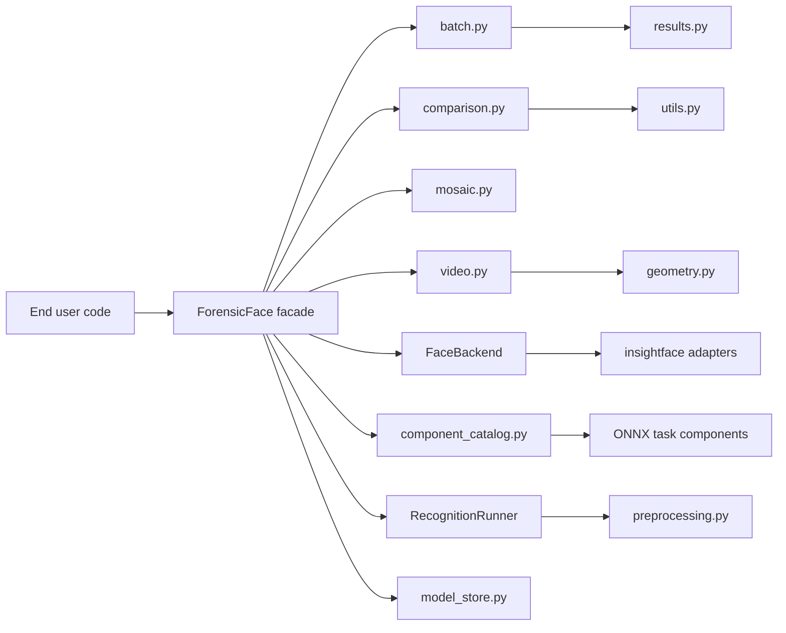
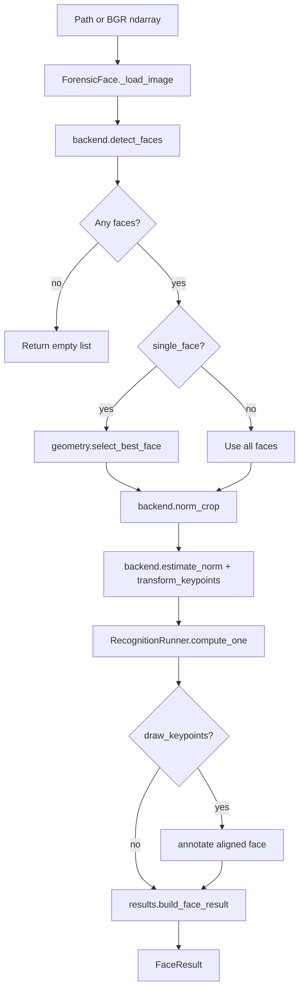
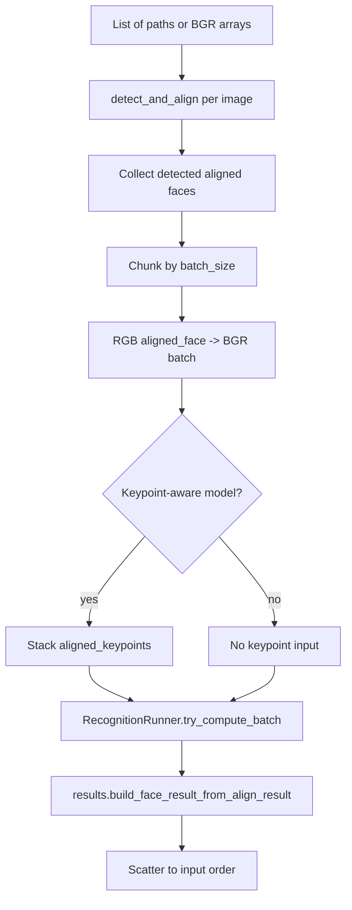
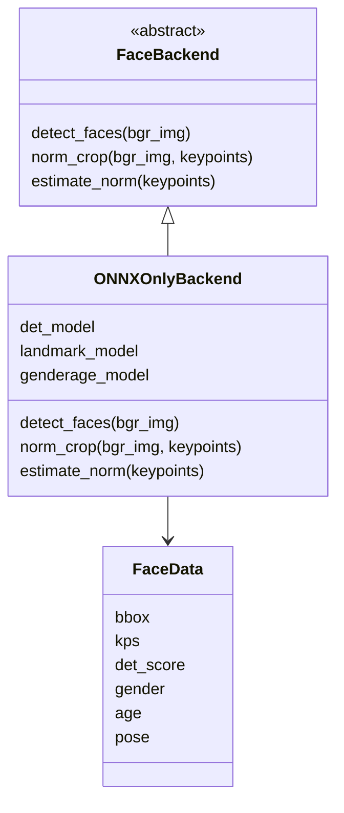

# ForensicFace Architecture and Contributor Guide

This document explains the logical blocks of `forensicface`, how they map to
end-user tasks, and where a contributor should start before changing the code.
It is intentionally higher level than API reference documentation.

## Big Picture

`forensicface` is a Python library for face-image processing in forensic face
examination workflows. The central public object is `ForensicFace` in
`src/forensicface/app.py`. It remains the end-user facade, while most
stateless work and larger task workflows live in focused modules.

The implementation has four main layers:

1. Public facade: `ForensicFace` exposes stable user-facing methods.
2. Task workflows: `batch.py`, `comparison.py`, `mosaic.py`, and `video.py`
   implement multi-step operations behind facade methods.
3. Model and data helpers: `recognition.py`, `preprocessing.py`, `results.py`,
   `geometry.py`, and `model_store.py` own reusable logic.
4. Component/model adapters: `components.py`, `component_catalog.py`,
   `onnx_components.py`, `backends.py`, and `insightface/` hide detector,
   alignment, landmark, attribute, quality, and embedding model details.



## End-User Tasks

| Task | Public entry point | Main implementation |
| --- | --- | --- |
| Process one image | `ForensicFace.process_image()` | `app.py`, `RecognitionRunner`, `results.py` |
| Detect and align without recognition/FIQA | `ForensicFace.detect_and_align()` | `app.py`, `geometry.py`, `results.py` |
| Process aligned crops in batch | `ForensicFace.process_aligned_faces_batch()` | `app.py`, `RecognitionRunner`, `results.py` |
| Process many images efficiently | `ForensicFace.process_images_batch()` | `batch.py` |
| Process one aligned crop | `ForensicFace.process_aligned_face_image()` | `app.py`, `RecognitionRunner`, `results.py` |
| Compare two images | `ForensicFace.compare()` | `comparison.py`, `utils.py` |
| Aggregate several images | `ForensicFace.aggregate_from_images()` | `comparison.py`, `utils.py` |
| Build an aligned-face mosaic | `ForensicFace.build_mosaic()` | `mosaic.py` |
| Extract faces from video | `ForensicFace.extract_faces()` | `video.py`, `geometry.py` |
| Compute evaluation scores | `utils.compute_ss_ds()` | `utils.py` |
| Migrate model files | `python -m forensicface.tools.migrate_shared` | `tools/migrate_shared.py` |
| Correct a CenterFace ONNX export | `python -m forensicface.tools.convert_centerface_onnx` | `tools/convert_centerface_onnx.py` |

Public face outputs are `FaceResult` objects. `FaceResult` is a `dict`
subclass, so existing code can use `ret["bbox"]`, while newer code can also use
attribute access such as `ret.bbox`.

## Single-Image Pipeline

`process_image()` is the reference path for one image. It loads the image,
detects faces, optionally chooses the best face, aligns each face, runs
recognition/FIQA, and builds a `FaceResult`.



Color order is an important convention:

- Inputs to public image methods are paths or BGR `ndarray` values.
- `backend.norm_crop()` returns BGR.
- Recognition ONNX sessions receive BGR crops after AdaFace-style
  preprocessing.
- Public result dictionaries expose `aligned_face` in RGB order.

## Batch Pipelines

There are two batch-oriented APIs.

`process_aligned_faces_batch()` accepts already aligned RGB crops with shape
`(N, 112, 112, 3)`. It converts them to BGR at the recognition boundary, calls
`RecognitionRunner.compute_batch()`, and uses `results.build_embedding_result()`
to build one `FaceResult` per crop.

`process_images_batch()` accepts paths or BGR arrays. It runs
`detect_and_align()` per image, stacks the aligned faces, performs batched
recognition/FIQA, and scatters the results back to the input order.



`sepaelv6` is currently listed in `KEYPOINT_RECOGNITION_MODELS`. For that
model, ONNX inputs must include both `input_images` and normalized `keypoints`.
`detect_and_align()` therefore includes `aligned_keypoints` in the 112x112
aligned face coordinate system.

## Functional Blocks

### `app.py`

`ForensicFace` owns runtime state and public method signatures:

- model names and ONNX Runtime providers;
- recognition sessions and optional CR-FIQA session;
- backend instance;
- options such as `extended`, `det_size`, `det_thresh`, and
  `concat_embeddings`.

Constructor calls using only legacy arguments retain the original backend
initialization path. Supplying any keyword-only task selector (`detection`,
`pose`, `gender`, `age`, `quality`, or `embedding`) activates the component
pipeline. Omitted optional selectors inherit from `extended`; explicit `None`
disables the task and causes its result fields to be omitted.

Keep end-user convenience methods here. Move stateless logic or large task
workflows out to helper modules.

Intentional private helpers still present:

- `_load_model()`: creates an ONNX Runtime recognition session from a resolved
  model path. It remains useful as an initialization and test seam.
- `_recognition_runner()`: builds the small runner object around current
  sessions/configuration.
- `_align_keypoints()`, `_draw_keypoints_on_aligned_face()`, and
  `_load_image()`: small facade-local helpers used by public workflows.

Deprecated public compatibility methods:

- `process_image_single_face()`
- `process_image_multiple_faces()`

### `recognition.py`

`RecognitionRunner` owns only embedding inference for aligned BGR crops.

It handles:

- single-crop inference through `compute_one()`;
- batch inference through `compute_batch()`;
- keypoint-aware model input dictionaries;
- two-output recognition models where embedding is scaled by norm;
- CUDA OOM fallback through `try_compute_batch()`.

`QualityRunner` in `quality.py` independently owns legacy or component quality
inference and its CUDA OOM fallback. `AlignedFaceRunner` in
`aligned_processing.py` combines recognition and quality results without
making either task depend on the other.

Small pure helpers in this module include `build_keypoint_model_inputs()`,
`looks_like_cuda_oom()`, and `try_compute_embeddings_batch()`.

### `preprocessing.py`

Preprocessing is stateless:

- `to_ada_input()` converts BGR crop(s) to normalized NCHW tensors.
- `normalize_aligned_keypoints()` converts aligned 5-point keypoints into the
  normalized ONNX input frame.

### `results.py`

Result creation is centralized here.

- `FaceResult(dict)` gives public results both dict and dot access.
- `AlignedFace` is the internal normalized representation used for full face
  results.
- `build_align_result()` builds detection/alignment outputs.
- `assemble_face_result()` and `build_face_result()` build full
  process-image outputs.
- `build_face_result_from_align_result()` bridges `detect_and_align()` results to
  batched recognition results.
- `build_embedding_result()` builds recognition-only outputs for aligned-face
  APIs.

### `batch.py`

`process_images_batch()` orchestration lives here. The function accepts a
`ForensicFace`-like processor object and uses its public `detect_and_align()` method
and recognition runner. This keeps the public API on `ForensicFace` while
moving chunking, scatter/gather, and result stitching out of `app.py`.

### `comparison.py`

Image comparison and image-set aggregation live here:

- `compare_faces()` calls the processor facade and computes cosine similarity.
- `aggregate_from_images()` calls the processor facade and aggregates
  embeddings with optional FIQA weighting.

The math itself lives in `utils.py`.

### `geometry.py`

Geometry helpers are pure:

- `select_best_face()` chooses by bbox size or centrality.
- `extend_bbox()` expands and clips a bbox for video crop export.

### `model_store.py`

All model layout resolution rules live here:

- `resolve_component_model()`
- `resolve_recognition_model()`
- `resolve_quality_model()`
- `collect_backend_model_files()`

This module understands the preferred task/alias layout, the prior flat shared
layout, and the original per-model layout.

### Extensible components

`components.py` defines `ModelSpec`, operational `ComponentMetadata`, the task
protocols, `FaceContext`, and `ComponentBackend`. `FaceContext` contains the
original BGR image, normalized detection, aligned BGR crop, aligned keypoints,
and alignment transform. Each estimator adapter still owns its crop choice,
resize, normalization, and native input dimensions.

`component_catalog.py` is the immutable built-in alias catalog and construction
boundary. Built-in aliases can be configured with a generic `ModelSpec`;
third-party implementations are supplied as constructed objects, without
mutating global registry state.

`onnx_components.py` contains the built-in adapters:

- SCRFD and CenterFace detection;
- InsightFace 3D-68 pose;
- joint InsightFace gender-age;
- CR-FIQA quality;
- SEPAEL ONNX embeddings, including keypoint-aware `sepaelv6`.

Joint estimators are deduplicated by identity/configuration, so the current
gender-age model runs once even when selected for both capabilities.
Face-estimator batching is deliberately outside the initial contract;
batching is supported only for embeddings and quality.

### `backends.py`

`FaceBackend` is the internal backend contract:

- `detect_faces(bgr_img) -> list[FaceData]`
- `norm_crop(bgr_img, keypoints) -> ndarray`
- `estimate_norm(keypoints) -> ndarray`

`ONNXOnlyBackend` remains the concrete legacy backend. `ComponentBackend` is
the explicit-selector path and composes independently selected task objects.



### Task Modules

- `mosaic.py`: builds aligned-face mosaics.
- `video.py`: exports detected face crops and optional metadata from video.
- `tools/migrate_shared.py`: migrates legacy model directories into the
  task/alias layout using a plan/apply/report structure.
- `tools/convert_centerface_onnx.py`: creates and verifies the dynamic-shape
  CenterFace artifact used by the ONNX Runtime adapter.

### Runtime and Utilities

- `ort_runtime_setup.py`: configures ONNX Runtime providers and dynamic library
  loading.
- `runtime_summary.py`: prints the initialization summary.
- `utils.py`: contains cosine scores, embedding aggregation, evaluation pair
  generation, environment capture, keypoint transforms, and annotation helpers.

## Model Directory Layout

Preferred layout:

```text
~/.forensicface/models/
  detection/
    scrfd/
      det_10g.onnx
    centerface/
      centerface.onnx
  pose/
    insightface-3d68/
      1k3d68.onnx
  attributes/
    insightface-genderage/
      genderage.onnx
  quality/
    cr-fiqa/
      cr_fiqa_l.onnx
  recognition/
    sepaelv2/
      *face*.onnx
    sepaelv6/
      *face*.onnx
```

The flat shared layout introduced in 0.7 remains a lookup fallback:

```text
~/.forensicface/models/
  detection/det_10g.onnx
  attributes/1k3d68.onnx
  attributes/genderage.onnx
  quality/cr_fiqa_l.onnx
```

Legacy fallback layout:

```text
~/.forensicface/models/
  <model_name>/
    det_10g.onnx
    1k3d68.onnx
    genderage.onnx
    cr_fiqa/
      cr_fiqa_l.onnx
    <recognition_subdir>/
      *face*.onnx
```

The model-store helpers are the source of truth for lookup behavior.
`python -m forensicface.tools.migrate_shared` migrates either historical
layout to task/alias directories. The CenterFace source export can be prepared
offline with `python -m forensicface.tools.convert_centerface_onnx`.

## Contribution Map

| Change type | Start here | Watch for |
| --- | --- | --- |
| Public image-processing behavior | `ForensicFace.process_image()` | Return-shape compatibility and warnings |
| Batched image workflow | `batch.py` | Result order, no-face slots, chunking, keypoint-aware models |
| Aligned-crop recognition | `process_aligned_face_image()`, `process_aligned_faces_batch()` | RGB input, BGR recognition boundary, `build_embedding_result()` |
| New recognition model | `RecognitionRunner`, `model_store.py` | ONNX input names, output format, preprocessing |
| New keypoint-aware model | `KEYPOINT_RECOGNITION_MODELS`, `recognition.py` | Single and batch keypoint normalization |
| Result keys or public return objects | `results.py` | Preserve dict access and `FaceResult` compatibility |
| New backend | `FaceBackend`, `create_backend()` | Return `FaceData` with 5-point keypoints |
| Runtime/provider issue | `ort_runtime_setup.py`, `runtime_summary.py` | Platform-specific provider behavior |
| Model folder changes | `model_store.py`, `tools/migrate_shared.py` | Backward compatibility with legacy layout |
| Video export behavior | `video.py` | Metadata serialization and crop bounds |
| Evaluation metrics | `utils.compute_ss_ds()` | Identity label alignment and pair generation |

## Testing Strategy

The tests use small fake sessions and fake backends so most behavior can be
validated without real ONNX models.

Recommended coverage:

- Facade return shapes and compatibility: `tests/test_backends_and_api.py`.
- Batch behavior and keypoint-aware paths: `tests/test_batch_api.py`.
- Pure helper modules and extracted workflows: `tests/test_helper_modules.py`
  and `tests/test_utils.py`.
- Model layout migration: `tests/test_migrate_shared.py`.

For changes that touch real model math or vendored InsightFace adapters, also
run at least one manual smoke test with a sample image and real models. Fake
sessions cannot detect numeric regressions inside model adapters.
