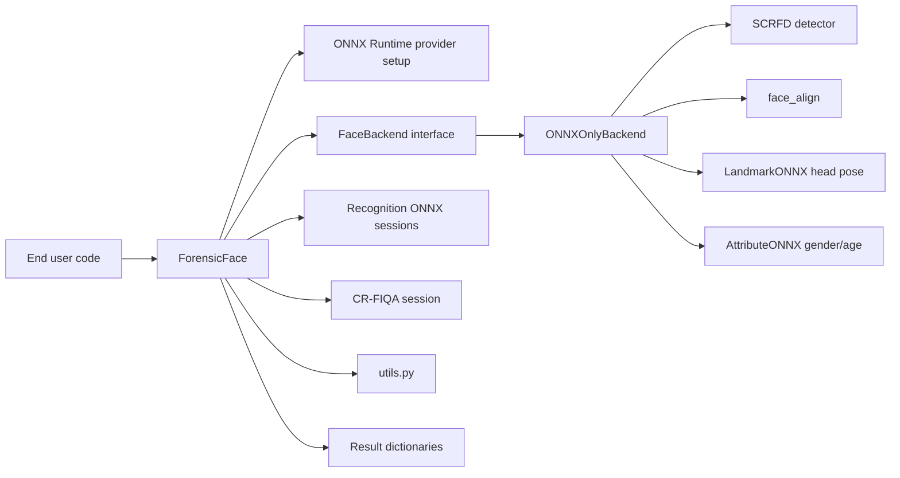
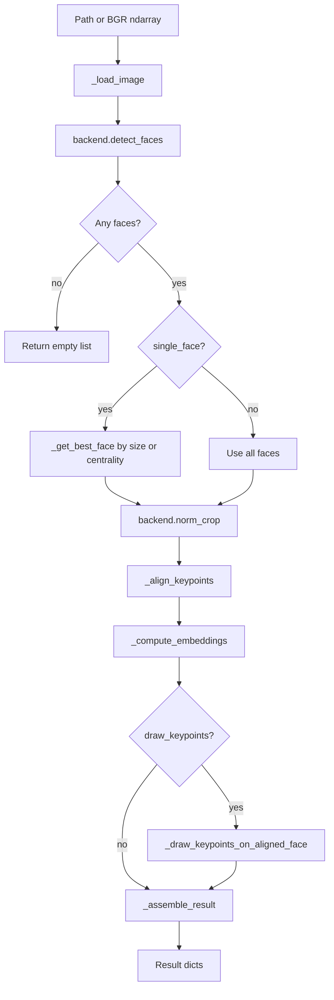
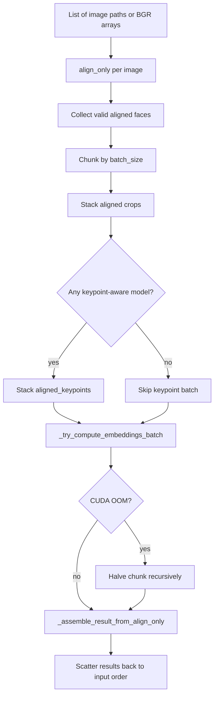
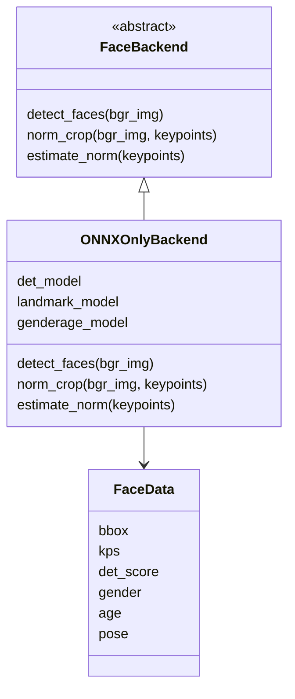

# ForensicFace Architecture and Contributor Guide

This document explains the logical blocks of `forensicface`, how they map to
end-user tasks, and where a contributor should look before changing the code.
It intentionally stays one level above API reference docs: the goal is to build
a mental model of the library.

## Big Picture

`forensicface` is a Python library for face-image processing in forensic face
examination workflows. The central public object is `ForensicFace` in
`src/forensicface/app.py`. It coordinates model loading, face detection,
alignment, recognition embeddings, image-quality estimation, attributes, image
comparison, batch processing, mosaics, and video face extraction.

The implementation has three main layers:

1. Public orchestration: `ForensicFace` exposes user tasks and coordinates the
   pipeline.
2. Backend/model adapters: `backends.py` and the vendored `insightface/`
   modules hide detector, alignment, landmark, and attribute model details.
3. Utilities and operations: runtime provider setup, environment summaries,
   metrics, annotations, scripts, tests, and model-layout migration tooling.



## End-User Tasks

The library's user-facing methods are organized around tasks rather than model
internals.

| Task | Public entry point | Output shape |
| --- | --- | --- |
| Process one image | `ForensicFace.process_image()` | One result dict by default; a list when `single_face=False` |
| Detect and align only | `ForensicFace.align_only()` | Aligned face data without embeddings/FIQA |
| Process many images efficiently | `ForensicFace.process_images_batch()` | List parallel to input images |
| Process an already aligned crop | `ForensicFace.process_aligned_face_image()` | Embedding dict and optional FIQA |
| Compare two images | `ForensicFace.compare()` | Cosine similarity float |
| Aggregate several images | `ForensicFace.aggregate_from_images()` | One embedding or per-model embedding dict |
| Build an aligned-face mosaic | `ForensicFace.build_mosaic()` | BGR mosaic image, optionally saved |
| Extract faces from video | `ForensicFace.extract_faces()` | Saved crops and optional JSONL metadata |
| Compute score labels for evaluation | `utils.compute_ss_ds()` | Scores, labels, optional file-name pairs |
| Migrate model files | `python -m forensicface.tools.migrate_shared` | Dry-run/apply migration plan |

## Main Image Pipeline

`process_image()` is the reference path for one image. It loads the image,
detects faces through the backend, optionally selects one face, aligns each
face, extracts embeddings, optionally computes FIQA, and assembles a result
object. Public face results are `FaceResult` objects: true `dict` subclasses
that preserve `ret["bbox"]` access while also allowing `ret.bbox`.



Result dictionaries use RGB for `aligned_face`, even though OpenCV input and
most intermediate processing use BGR. Contributors should be careful at every
OpenCV boundary:

- Inputs to `ForensicFace` methods are paths or BGR `ndarray` values.
- `backend.norm_crop()` returns BGR.
- Public result dictionaries expose `aligned_face` as RGB.
- Batched recognition converts RGB aligned crops back to BGR before ONNX input.

## Batch Image Pipeline

`process_images_batch()` reuses the same logical steps but separates alignment
from recognition. Detection/alignment still runs per image. Recognition and
FIQA run in chunks, using one ONNX call per batch.



Key detail: `sepaelv6` is listed in `KEYPOINT_RECOGNITION_MODELS`, so its ONNX
session expects both `input_images` and normalized `keypoints`. `align_only()`
therefore precomputes `aligned_keypoints` for batch processing.

## Functional Blocks

### Public Orchestrator: `app.py`

`ForensicFace` owns long-lived runtime state:

- selected recognition model names;
- ONNX Runtime providers;
- recognition inference sessions;
- optional CR-FIQA session;
- the configured `FaceBackend`;
- options such as `extended`, `det_size`, `det_thresh`, and
  `concat_embeddings`.

Important method groups:

- Initialization and model lookup: `__init__()`, `_load_model()`,
  `_resolve_quality_model()`, `_get_loaded_modules()`. Path-resolution rules
  live in `model_store.py`.
- Image processing: `_load_image()`, `process_image()`, `align_only()`,
  `process_aligned_face_image()`.
- Embedding inference: `_to_input_ada()`, `_compute_embeddings()`,
  `_compute_embeddings_batch()`, `_try_compute_embeddings_batch()`. Stateless
  preprocessing lives in `preprocessing.py`; recognition/FIQA ONNX execution
  lives in `recognition.py`.
- Keypoint-aware recognition: `_build_keypoint_model_inputs()`,
  `_to_keypoints_input()`.
- Result assembly: `_assemble_result()`,
  `_assemble_result_from_align_only()`. Shared result construction and
  `FaceResult` live in `results.py`.
- Convenience workflows: `compare()`, `aggregate_embeddings()`,
  `aggregate_from_images()`, `build_mosaic()`, `extract_faces()`.
- Deprecated compatibility wrappers: `process_image_single_face()` and
  `process_image_multiple_faces()`.

### Backend Abstraction: `backends.py`

`FaceBackend` is the narrow internal contract that keeps the high-level
pipeline independent from the specific detector/alignment implementation:

- `detect_faces(bgr_img) -> list[FaceData]`
- `norm_crop(bgr_img, keypoints) -> ndarray`
- `estimate_norm(keypoints) -> ndarray`

`ONNXOnlyBackend` is currently the only concrete backend. It discovers ONNX
files, loads detector/landmark/gender-age models, prepares them, and converts
their outputs into the `FaceData` dataclass.



### Vendored InsightFace Components

The `src/forensicface/insightface/` package contains small adapted pieces from
InsightFace:

- `scrfd.py`: SCRFD detector, anchor/grid decoding, NMS.
- `face_align.py`: affine estimation and normalized 112x112 crop.
- `landmark.py`: 2D/3D landmark inference and pose estimation.
- `attribute.py`: gender/age inference.
- `transform.py` and `meanshape68.py`: math and reference shape data used by
  the landmark model.

These files are closer to model-adapter code than application logic. Changes
here need extra care because they are adapted from an external implementation
and influence low-level numeric behavior.

### Runtime Setup

`ort_runtime_setup.py` configures ONNX Runtime providers and dynamic library
loading. It handles:

- CUDA provider preference on Linux and Windows;
- NVIDIA wheel library discovery;
- `PATH`/`LD_LIBRARY_PATH` updates;
- Linux shared-library preloading;
- CoreML fallback on macOS;
- CPU fallback.

`runtime_summary.py` builds the user-visible initialization message. It probes
providers from loaded sessions and reports whether all models use the same
provider or whether sessions differ.

### General Utilities

`utils.py` contains stateless helpers:

- `cosine_similarity()`
- `compute_ss_ds()`
- `freeze_env()`
- `transform_keypoints()`
- `annotate_img_with_kps()`

These are good examples of code that does not need the `ForensicFace` instance
and can stay as pure or nearly pure functions.

### Model Layout Migration

`tools/migrate_shared.py` is a command-line utility for migrating model files
from the legacy per-model layout to the newer shared layout. Its design is
already split into:

- read-only planning: `build_plan()`;
- effectful application: `apply_plan()`;
- presentation: `format_plan()`;
- CLI parsing: `main()`.

That separation makes the tool easier to test and safer to run.

## Model Directory Layout

Current preferred layout:

```text
~/.forensicface/models/
  detection/
    det_10g.onnx
  attributes/
    1k3d68.onnx
    genderage.onnx
  quality/
    cr_fiqa_l.onnx
  recognition/
    sepaelv2/
      *face*.onnx
    sepaelv6/
      *face*.onnx
```

Legacy fallback layout is still supported:

```text
~/.forensicface/models/
  <model_name>/
    det_10g.onnx
    1k3d68.onnx
    genderage.onnx
    cr_fiqa/
      cr_fiqa_l.onnx
    <recognition_subdir>/
      *face*.onnx
```

Model lookup is split between:

- `ForensicFace._load_model()`: recognition model sessions;
- `ForensicFace._resolve_quality_model()`: CR-FIQA model;
- `ONNXOnlyBackend._collect_onnx_files()`: detection and attribute candidates.

## Contribution Map

Use this table when deciding where to start.

| Change type | Start here | Watch for |
| --- | --- | --- |
| New public face-processing option | `ForensicFace.process_image()` and `process_images_batch()` | Keep single and batch outputs compatible |
| New recognition model | `_compute_embeddings()`, `_compute_embeddings_batch()`, model lookup | ONNX input names, preprocessing, embedding output format |
| New keypoint-aware model | `KEYPOINT_RECOGNITION_MODELS`, `_build_keypoint_model_inputs()` | Batch and single-face keypoint normalization |
| New backend | `FaceBackend` and `create_backend()` | Return `FaceData` with 5-point keypoints for alignment |
| Runtime/provider issue | `ort_runtime_setup.py`, `runtime_summary.py` | Platform-specific provider behavior |
| Model folder changes | `app.py`, `backends.py`, `tools/migrate_shared.py` | Backward compatibility with legacy layout |
| Video export behavior | `extract_faces()` | Metadata serialization and crop coordinate bounds |
| Evaluation metrics | `utils.compute_ss_ds()` | Pair generation and identity label alignment |

## Testing Strategy

The tests use small fake sessions and fake backends so most behavior can be
validated without real ONNX models. That is the right pattern for new
orchestration behavior.

Recommended coverage for common changes:

- Public API shape changes: add tests in `tests/test_backends_and_api.py`.
- Batch behavior: add tests in `tests/test_batch_api.py`.
- Model layout migration: add tests in `tests/test_migrate_shared.py`.
- Runtime setup changes: prefer focused unit tests that monkeypatch platform,
  provider, and filesystem probes.

For changes that touch actual model math or the vendored InsightFace adapters,
also run at least one manual smoke test with a sample image and real models,
because fake sessions cannot detect numeric regressions.
