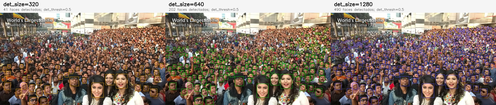
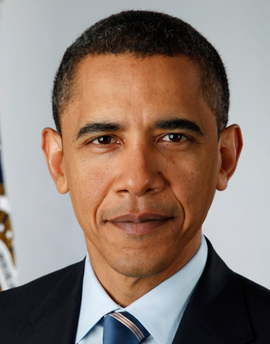
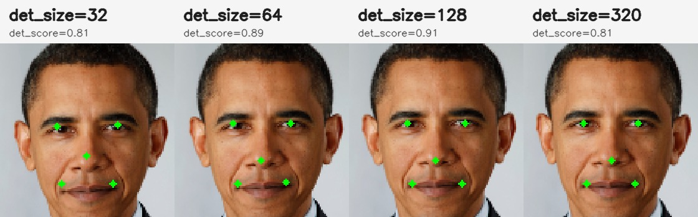
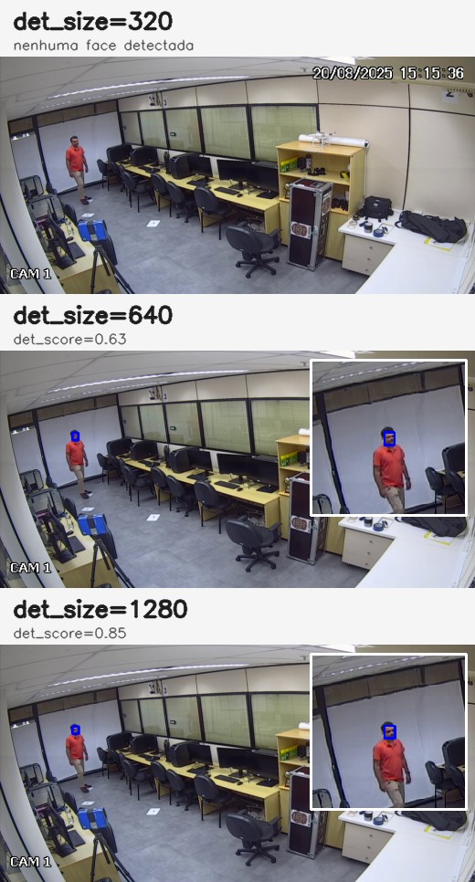
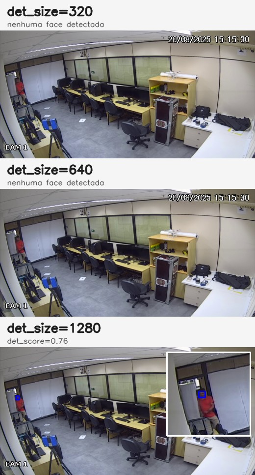
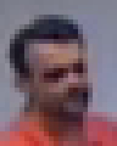
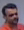
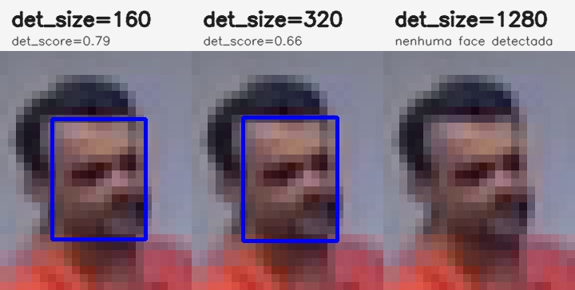

`det_size` controla o tamanho da imagem que entra no detector de faces SCRFD.
No `ForensicFace`, o valor informado é convertido para uma janela quadrada:

```python
ff = ForensicFace(det_size=320)
```

internamente usa:

```python
det_size = (320, 320)
```

A imagem original é redimensionada mantendo a proporção, encaixada dentro dessa janela quadrada e completada com bordas pretas quando necessário. Depois da detecção, os bounding boxes e os pontos faciais são convertidos de volta para as coordenadas da imagem original.

O valor de `det_size` não muda a imagem final alinhada, que continua sendo uma face de `112 x 112` para os modelos de reconhecimento. O `det_size` muda apenas o tamanho com que cada face é "vista" pelo detector antes do alinhamento.

Exemplo: se uma face ocupa cerca de 5% do maior lado da imagem:

- com `det_size=320`, ela terá aproximadamente `16 px` no detector;
- com `det_size=640`, ela terá aproximadamente `32 px`;
- com `det_size=1280`, ela terá aproximadamente `64 px`.

O valor padrão de `det_size` do `forensicface` é 320.  

Os exemplos a seguir ilustram situações diversas que demonstram a importância da escolha adequada do valor de `det_size`.

## Exemplo: World's Largest Selfie

A imagem abaixo tem `2048 x 1150` pixels e contém faces de vários tamanhos. Usando o mesmo detector (`det_10g.onnx`) e o mesmo limiar `det_thresh=0.5`, apenas mudando `det_size`, o número de faces detectadas muda bastante:

{.lightbox}

Com `det_size=320`, o detector encontra principalmente faces grandes e relativamente nítidas. Com `det_size=640`, faces menores começam a entrar no regime de escala em que o SCRFD trabalha melhor. Com `det_size=1280`, muitas faces pequenas passam a ser detectadas, mas o custo computacional também sobe.

| `det_size` | Faces detectadas | Menor face detectada, aprox. |
|---:|---:|---:|
| 320 | 41 | 36,7 px |
| 640 | 202 | 16,2 px |
| 1280 | 490 | 8,3 px |

Observação: os tamanhos acima são medidos como `sqrt(largura * altura)` do bounding box detectado na imagem original. Eles descrevem esta imagem específica, não uma garantia geral de desempenho.

## Exemplo: face grande na imagem

Quando a face ocupa uma grande proporção da imagem, valores pequenos de `det_size` já podem ser suficientes. A imagem abaixo tem `270 x 344` pixels, e a face ocupa boa parte da imagem. Nesse caso, até `det_size=32` detecta a face.



A figura abaixo foi gerada com `ff.process_image(..., draw_keypoints=True)`. A opção `draw_keypoints=True` desenha os cinco pontos faciais na face alinhada retornada pelo `forensicface`.

{.lightbox}

Esse exemplo também mostra que **detectar uma face não significa necessariamente localizar os pontos faciais com a mesma precisão**. Com `det_size=32`, a face é detectada, mas os *keypoints* ficam visivelmente menos bem posicionados, porque a imagem foi reduzida para uma janela muito pequena antes da detecção. Com `det_size=64`, os pontos já melhoram. Com `det_size=128` e `det_size=320`, os keypoints ficam mais estáveis e melhor alinhados. Isso importa porque o `forensicface` usa esses pontos para gerar a face alinhada de `112 x 112` pixels, a partir da qual são extraídas as embeddings para reconhecimento.

Quando a face já ocupa uma proporção grande na imagem, aumentar `det_size` tende a trazer pouco ganho para a detecção. Nesses casos, `320` é uma escolha conservadora e prática. Valores menores podem até funcionar, mas devem ser testados.

## Exemplo: CFTV com face distante

Em imagens de CFTV, a resolução total do frame pode parecer alta, mas a face pode ocupar poucos pixels. A imagem a seguir tem `960 x 480` pixels. Com `det_size=320`, a face não é detectada com `det_thresh=0.5`. Com `640` e `1280`, a face passa a ser detectada.

| `det_size` | Resultado |
|---:|---|
| 320 | nenhuma face detectada |
| 640 | 1 face, `det_score=0,63` |
| 1280 | 1 face, `det_score=0,85` |

{.lightbox}

A imagem a seguir é ainda mais desafiadora: a pessoa está parcialmente na borda da imagem, a face é menor e há menos detalhe visual disponível. Nesse caso, só `det_size=1280` detectou a face com `det_thresh=0.5`.

{.lightbox}

### Redetectando um crop salvo

Uma situação comum ao processar vídeo é detectar a face no frame inteiro com `det_size` alto, recortar a região da face com margem e salvar esse recorte como uma imagem. O método `extract_faces()` do `forensicface` permite fazer isso.

A partir da detecção em `cftv_distant.png` com `det_size=1280`, foi salvo um crop com o bounding box estendido em 100% em cada dimensão, configuração padrão do forensicface. A imagem salva tem apenas `24 x 30` pixels:



A imagem acima está ampliada apenas para visualização. O tamanho real da imagem salva é este:



Ao tentar detectar novamente a face nessa imagem, usar o mesmo `det_size=1280` falha. Com `det_size=160` ou `det_size=320`, a face volta a ser detectada:

{.lightbox}

Isso acontece porque `det_size` sempre é aplicado à imagem que está sendo processada naquele momento. No frame inteiro, a face é minúscula em relação aos `960 x 480` pixels, então `det_size=1280` ajuda a trazê-la para uma escala mais detectável. Depois do recorte, a mesma face passa a ocupar uma proporção grande da imagem de `24 x 30` pixels. Redimensionar esse crop para `1280 x 1280` faz a face ficar enorme na entrada do detector e amplia apenas os blocos, ruído e compressão já presentes no recorte. Com `det_size=160` ou `320`, a face entra em uma faixa de escala mais razoável para o SCRFD.

Esses exemplos mostram um limite importante: aumentar `det_size` pode fazer uma face pequena ser detectada, mas não cria detalhe facial novo. Quando a face tem poucos pixels na imagem original (aproximadamente 15 pixels de altura neste exemplo), o alinhamento e a embedding ainda devem ser interpretados com cautela, mesmo quando o detector retorna uma detecção com boa confiança.

## Relação com o SCRFD

O detector usado pelo `forensicface` é baseado no SCRFD, descrito no artigo [Sample and Computation Redistribution for Efficient Face Detection](https://arxiv.org/abs/2105.04714).

O SCRFD foi desenhado pensando em detecção eficiente de faces em múltiplas escalas. No modelo `det_10g.onnx` usado pelo `forensicface`, a detecção é feita em mapas de características com strides `8`, `16` e `32`. Isso significa que faces muito pequenas na imagem de entrada do detector dependem fortemente dos níveis mais rasos, especialmente o stride `8`.

Por isso, o valor de `det_size` muda a dificuldade do problema:

- se a face fica muito pequena dentro da janela do detector, ela pode não produzir evidência suficiente para ser detectada;
- se a face fica em uma faixa de escala mais confortável, a chance de detecção e a precisão dos pontos faciais aumentam;
- se `det_size` cresce muito, o detector avalia muito mais posições e pode encontrar mais faces pequenas, mas também pode encontrar falsos positivos em texturas, óculos, mãos, cartazes e regiões borradas.

## Sugestões para escolher na prática

Comece com `det_size=320` quando:

- a imagem é um retrato, selfie simples, foto de documento ou rosto ocupando boa parte do quadro;
- a face principal ocupa mais ou menos 10% ou mais do maior lado da imagem;
- você quer boa velocidade e não espera muitas faces pequenas.

Use `det_size=640` quando:

- a imagem tem várias pessoas;
- a face de interesse ocupa algo entre 5% e 10% do maior lado;
- você está processando frames de vídeo, screenshots ou imagens de cena aberta;
- `det_size=320` perde faces que visualmente ainda parecem aproveitáveis.

Considere `det_size=960` ou `det_size=1280` quando:

- as faces são pequenas, mas ainda têm detalhe real na imagem original;
- o objetivo é maximizar recall em fotos de grupo ou imagens investigativas;
- o tempo de processamento e o uso de memória são aceitáveis;
- você revisará os resultados, porque podem aparecer mais falsos positivos.

Evite aumentar `det_size` esperando recuperar informação que não existe. Se a face original tem pouquíssimos pixels, está muito borrada, comprimida ou oculta, aumentar `det_size` apenas amplia a mesma falta de detalhe.

Uma tabela prática:

| Face em relação ao maior lado da imagem | Tamanho efetivo com `320` | Tamanho efetivo com `640` | Sugestão inicial |
|---:|---:|---:|---|
| 20% | 64 px | 128 px | `320` deve bastar |
| 10% | 32 px | 64 px | `320` ou `640` |
| 5% | 16 px | 32 px | `640` pode ser melhor |
| 2,5% | 8 px | 16 px | `960` ou `1280`, se houver detalhe |
| 1% | 3 px | 6 px | considere recortar a imagem original |

É obrigatório que o valor de `det_size` seja múltiplo de `32`, como `320`, `640`, `960` ou `1280`. Valores que não sejam múltiplos de 32 resultarão em erro de processamento na etapa de detecção.

## Custo computacional

O custo do detector cresce aproximadamente com a área da janela:

```text
640  ~= 4x o custo de 320
960  ~= 9x o custo de 320
1280 ~= 16x o custo de 320
```

Na prática, o impacto depende do hardware, do provedor do ONNX Runtime (`CUDAExecutionProvider`, `CPUExecutionProvider`, etc.) e do restante do fluxo. O reconhecimento facial ainda roda sobre faces alinhadas de `112 x 112`, mas uma detecção maior pode produzir muito mais faces para alinhar e processar.

## Interação com qualidade da imagem

`det_size` ajuda quando a face está pequena em uma imagem que ainda preserva detalhes. Ele ajuda menos quando o problema principal é qualidade:

- desfoque de movimento;
- compressão forte;
- baixa iluminação;
- face fora de foco;
- pose extrema;
- oclusão por mãos, cabelo, máscara, óculos escuros ou outras pessoas.

Nesses casos, aumentar `det_size` pode até detectar mais faces, mas nem sempre melhora o alinhamento ou a qualidade da embedding. Para uso forense, vale olhar também para os pontos faciais, a face alinhada e a qualidade visual do recorte.

## Interação com `det_thresh`

`det_size` e `det_thresh` controlam coisas diferentes:

- `det_size` muda a escala em que o detector vê a imagem;
- `det_thresh` muda o limiar mínimo de confiança para aceitar uma detecção.

Reduzir `det_thresh` pode aumentar recall, mas também aumenta falsos positivos.
Aumentar `det_size` pode tornar faces pequenas mais detectáveis sem baixar o
limiar, mas também aumenta custo e pode revelar candidatos ambíguos.

Uma estratégia razoável:

1. comece com `det_size=320` e `det_thresh=0.5`;
2. se faces pequenas forem perdidas, tente `det_size=640`;
3. se o objetivo for busca ampla em multidões ou imagens grandes, teste
   `det_size=960` ou `1280`;
4. só depois ajuste `det_thresh`, e revise visualmente as detecções.

## Resumo

**`det_size` deve ser escolhido principalmente pela relação entre o tamanho da face e o tamanho da imagem**, não apenas pela resolução total da imagem. Para faces ocupando uma boa proporção da imagem, `320` tende a ser suficiente. Para faces pequenas em imagens grandes, `640` é um bom primeiro aumento. Para multidões ou busca de faces muito pequenas, `960` ou `1280` podem melhorar recall, com custo computacional maior e possibilidade maior de falsos positivos.
